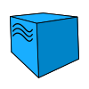
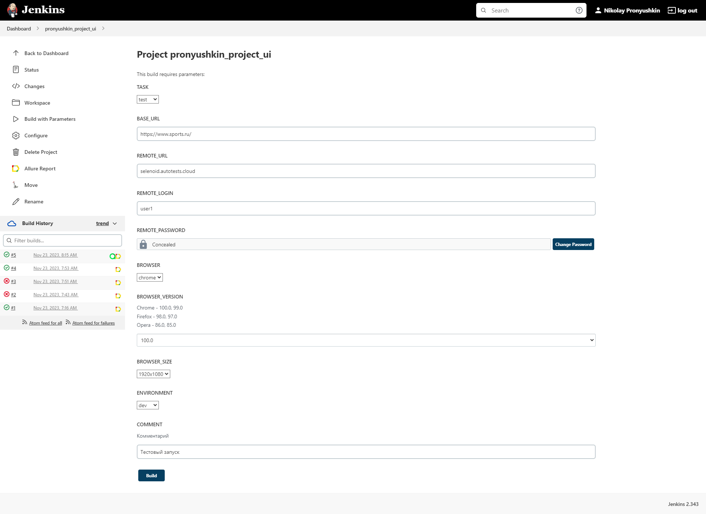
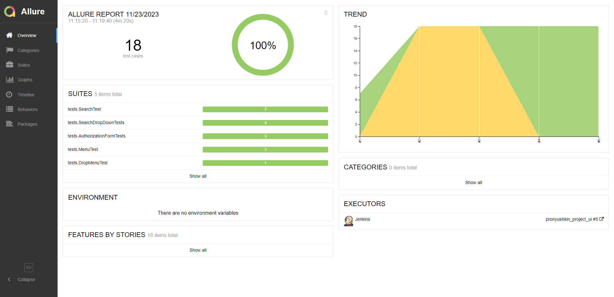
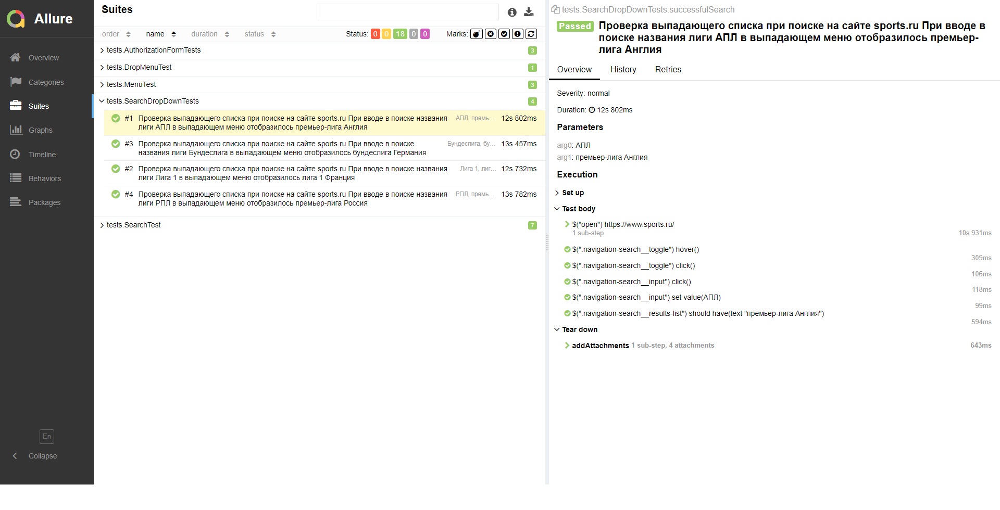
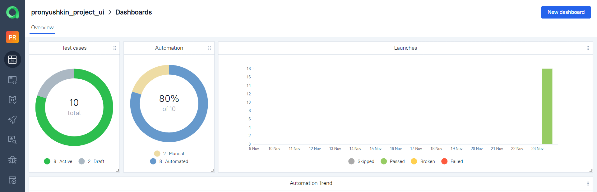
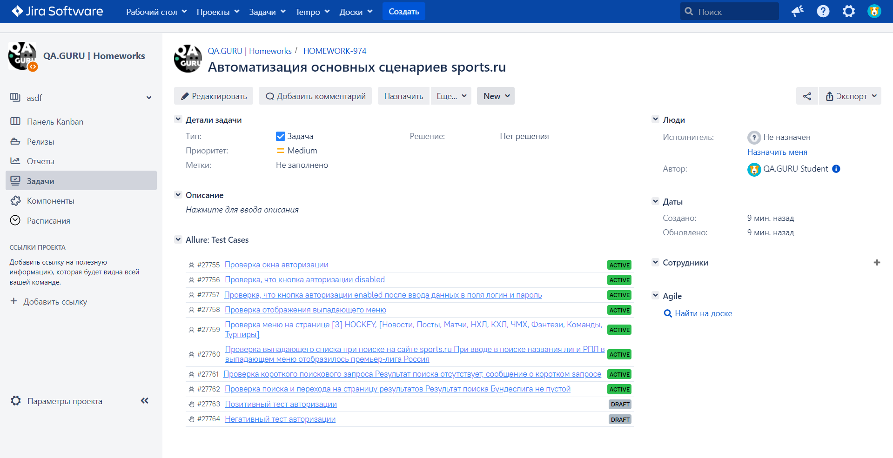
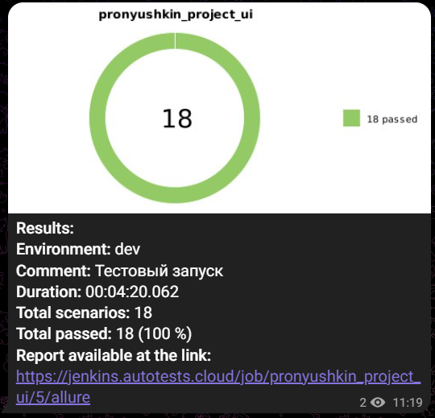
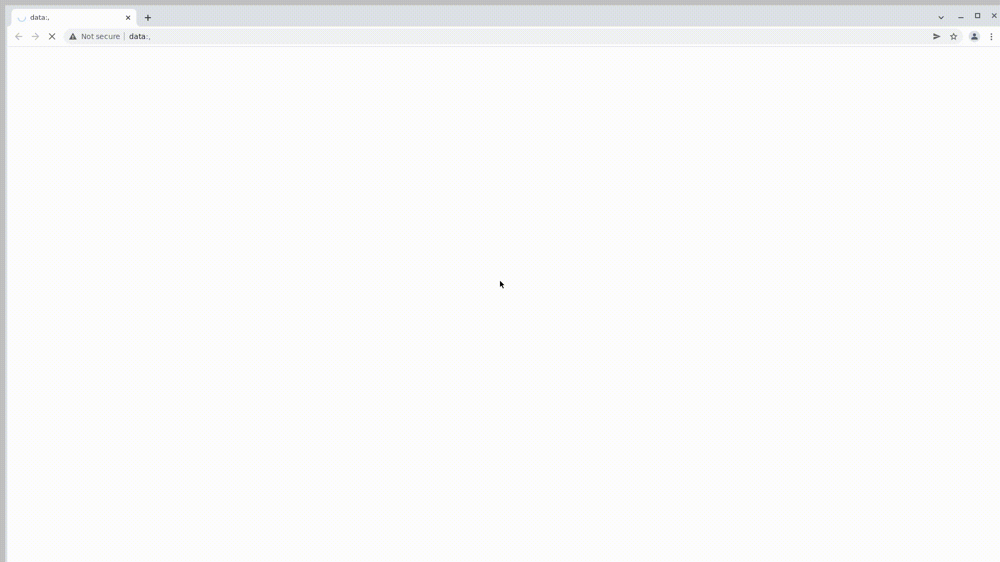

# Проект UI тестов для сайта [Sports.ru](https://sports.ru/)

<p>
  
</p>

## Содержание:
+ [Стек технологий](#computer-использованный-стек-технологий)
+ [Тестовые сценарии](#clipboard-Тестовые-сценарии)
+ [Запуск тестов из терминала](#desktop_computer-Запуск-тестов-из-терминала)
+ [Сборка в Jenkins](#-Сборка-в-Jenkins)
+ [Интеграция с Allure report](#-Интеграция-с-Allure-report)
+ [Интеграция с Allure TestOps](#-Интеграция-с-Allure-testOps)
+ [Интеграция с Jira](#-Интеграция-с-Jira)
+ [Уведомления в Telegram](#-Уведомления-в-Telegram)
+ [Видео прохождения тестов](#cinema-Пример-видео-прохождения-тестов)

## :computer: Стек технологий

<p align="left"> 




</p>


## :clipboard: Тестовые сценарии
+ :white_check_mark: Проверка окна авторизации
+ :white_check_mark: Проверка корректности отображения пунктов меню для разных страниц сайта
+ :white_check_mark: Проверка отображения выпадающего меню
+ :white_check_mark: Проверка отображения результатов поиска
+ :white_check_mark: Проверка выпадающего списка при осуществлении поиска

### Запуск тестов из терминала
```
gradle clean test
```

###  [Сборка в Jenkins](https://jenkins.autotests.cloud/job/pronyushkin_project_ui/build?delay=0sec) 

Также можно переопределить параметры запуска:

```
clean
${TASK}
-DbaseUrl=${BASE_URL}
-Dbrowser=${BROWSER}
-DbrowserVersion=${BROWSER_VERSION}
-DbrowserSize=${BROWSER_SIZE}
-Dselenoid.url=${REMOTE_URL}
-Dselenoid.login=${REMOTE_LOGIN}
-Dselenoid.password=${REMOTE_PASSWORD}
```

### Параметры сборки

* <code>BROWSER</code> – браузер, в котором будут выполняться тесты. По-умолчанию - <code>chrome</code>.
* <code>BROWSER_VERSION</code> – версия браузера, в которой будут выполняться тесты. По-умолчанию - <code>100.0</code>.
* <code>BROWSER_SIZE</code> – размер окна браузера, в котором будут выполняться тесты. По-умолчанию - <code>1920x1080</code>.
* <code>REMOTE_URL</code> – адрес удаленного сервера, на котором будут запускаться тесты.
* <code>REMOTE_LOGIN</code> – логин пользователя для удаленного запуска тестов.
* <code>REMOTE_PASSWORD</code> – пароль пользователя для удаленного запуска тестов.

<p align="center">

</p>

##  <a href="https://jenkins.autotests.cloud/job/pronyushkin_project_ui/5/allure/#" target="_blank">Пример Allure-отчета</a>

<p align="center">

</p>

### Результат выполнения теста

<p align="center">

</p>

##  <a href="https://allure.autotests.cloud/project/3841/dashboards" target="_blank">Интеграция с Allure TestOps</a>

Выполнена интеграция сборки <code>Jenkins</code> с <code>Allure TestOps</code>.
Результат выполнения автотестов отображается в <code>Allure TestOps</code>
На Dashboard в <code>Allure TestOps</code> отображена статистика пройденных тестов.

<p align="center">

</p>

##  <a href="https://jira.autotests.cloud/browse/HOMEWORK-974" target="_blank">Интеграция с Jira</a>

Реализована интеграция <code>Allure TestOps</code> с <code>Jira</code>. В задаче отображаются прикреплённые к ней тест-кейсы, а также результаты запусков/прохождения тестов.

<p align="center">

</p>


##  <a href="https://t.me/+W3sjUdH_PSk1Mjdi" target="_blank">Уведомления в Telegram с использованием бота</a> 


После завершения сборки, бот созданный в <code>Telegram</code>, автоматически обрабатывает и отправляет сообщение с результатом.

<p align="center">

</p>

## :cinema: Пример видео прохождения тестов

К каждому тесту в отчете прилагается видео прогона.
<p align="center">
   
</p>
